<p align="center">
  
</p>

<p align="center">
  <a href="https://opensource.org/licenses/GPL-3.0"></a>
  <a href="https://www.typescriptlang.org/"></a>
  <a href="https://www.electronjs.org/"></a>
  <a href="https://reactjs.org/"></a>
  <a href="https://mavlink.io/"></a>
  <a href="https://github.com/iNavFlight/inav/wiki/MSP-V2"></a>
  <a href="https://discord.gg/JX2JdVXPPC"></a>
  <a href="https://jawji.space"></a>
</p>

<p align="center">
  <strong>A modern ground control station for ArduPilot, Betaflight, and iNav.</strong>
</p>

<p align="center">
  <sub>Supported by</sub><br />
  <a href="https://adlerblix.de" target="_blank" rel="noopener noreferrer"></a>
</p>

> **ALPHA SOFTWARE** - Jawji is under active development. Features may be incomplete, unstable, or change without notice. **Use at your own risk** and always have a backup configuration tool available. We appreciate early testers - [join our Discord](https://discord.gg/JX2JdVXPPC) for support and updates, or [report bugs](#bug-reporting) to help improve the project!

Jawji is a next-generation ground control station built with Electron, React, and TypeScript. It provides real-time telemetry, parameter management, PID tuning, and mission planning for drones and vehicles running ArduPilot, Betaflight, or iNav firmware.

> **One app for all your flight controllers** - Windows, modern UI, supports both MAVLink and MSP protocols.

---

## Table of Contents

- [Features](#features)
- [Screenshots](#screenshots)
- [Download & Install](#download--install)
- [Architecture](#architecture)
- [Development (Contributors Only)](#development-contributors-only)
- [Supported Vehicles](#supported-vehicles)
- [Veteran Board Support](#️-veteran-board-support)
- [Bug Reporting](#bug-reporting)
- [Roadmap](#roadmap)
- [Contributing](#contributing)
- [Sponsors](#sponsors)
- [Acknowledgments](#acknowledgments)

---

## Features

### Real-Time Telemetry
- **Attitude Indicator** - Roll, pitch, yaw with compass heading
- **Flight Data** - Altitude (MSL/AGL), airspeed, ground speed, climb rate
- **GPS Status** - Fix type, satellite count, HDOP, coordinates
- **Battery Monitor** - Voltage, current, remaining capacity with visual indicator
- **Flight Mode** - Armed/disarmed status, current mode display

### Interactive Map
- **Live Vehicle Tracking** - Real-time position with heading indicator
- **Flight Trail** - Historical path visualization
- **Multiple Layers** - Street, Satellite, Google Sat, Hybrid, Terrain, Dark mode
- **Home Position** - Distance and bearing to home
- **Overlays** - Compass, attitude indicator, stats
- **Weather Radar** - RainViewer weather overlay with dynamic color schemes
- **Airspace Zones** - Colored CTR, restricted, danger, and TMA zone polygons with legend
- **Aviation Charts** - OpenAIP tile layer with airports, navaids, and zoom-adaptive aviation symbology
- **Terrain Elevation** - Color-coded height overlay with auto-range and relative-to-craft modes
- **Offline Maps** - Download map regions for offline use with tile caching

### Companion Board Support
- **One-Script Installer** - `curl -fsSL https://jawji.space/install.sh | sudo bash` sets up a Raspberry Pi, Jetson, or generic Linux companion computer end to end - hardware auto-detected, pick a profile (Basic/Vision/AI) or an interactive menu, only what you need gets installed
- **Controller Auto-Setup** - On every boot, the controller automatically detects flight controllers via USB serial, installs and configures mavlink-router (FC UART → UDP:14550 + TCP:5760), detects cameras and installs MediaMTX (RTSP/WebRTC/HLS), and configures the TCP/UDP bridge so the desktop app can connect without manual network setup
- **Companion Board Store** - Browse pre-configured templates for ESP32, Raspberry Pi, Jetson, and Orange Pi
- **ESP32 Flashing** - Direct USB flash with auto-downloaded esptool (DroneBridge, MAVLink bridge)
- **DroneBridge Integration** - Auto-detect DroneBridge ESP32 on network, view status, configure WiFi/serial settings
- **Controller Dashboard** - Real-time CPU/RAM/temp metrics, terminal access, service management for companion computers, with mDNS "Scan for controllers" discovery and automatic reconnect to the last-paired device on launch
- **MediaMTX Video Relay** - A real multi-protocol media server (RTSP/RTMP/HLS/WebRTC) on the companion side, queried live by Jawji Controller for stream status
- **Dockview Layouts** - Customizable panel layouts with presets (Overview, Debug, Manage)
- **Encrypted API Keys** - Secure storage for OpenAIP and other service credentials
- **[jawji-orchestrator](https://github.com/utachicodes/jawji-orchestrator)** - A separate, independently published package (`@jawji/orchestrator` on npm) for onboard vision-assisted autonomy on a companion computer. Runs standalone, with its own MAVSDK connection to the flight controller, whether or not a Jawji GCS is connected. Not yet wired into Jawji desktop or Jawji Controller - see that repo for details.

### Dockable Dashboard
- **IDE-Style Panels** - Drag & drop layout customization
- **Save/Load Layouts** - Multiple named layout profiles
- **Resizable Panels** - Flexible workspace arrangement

### Fleet Management
- **Multi-Vehicle Roster** - Add several MAVLink or MSP vehicles to a saved fleet, persisted across restarts
- **Live Status Overview** - Armed state, mode, battery, and position for every roster vehicle at once, over lightweight read-only connections
- **Shared Map** - See every fleet vehicle's live position on one map
- **Focus to Fly** - Promote any fleet vehicle to the main connection for full mission planning, parameter tuning, and control - exactly as today's single-vehicle workflow

### Camera Feed
- **MJPEG or WebRTC** - Dockable panel showing the focused vehicle's live camera feed, either as a classic MJPEG multipart stream or low-latency WebRTC via a MediaMTX WHEP endpoint (e.g. a companion Pi running the Vision Companion profile)
- **Manual or Auto-Detected** - Paste a stream URL directly, or let Jawji request it from the flight controller via MAVLink `VIDEO_STREAM_INFORMATION`
- **Pop-Out Support** - Detach the camera feed to its own window like any other telemetry panel

### AI Computer Vision (Module)
- **Live Object Detection** - The AI Object Detection module runs YOLOv8 against the Camera panel's feed and draws bounding boxes directly on the video
- **Runs Locally** - Python process spawned via the module system's PTY permission, no cloud dependency
- **Extensible** - Built on general-purpose module host APIs (`camera`, `pty`, `moduleDir`) any future module can reuse for its own video-processing or Python-backed features

### Mission Planning
- **Interactive Map Editing** - Click to add waypoints, drag to reposition
- **Mission Groups** - Every waypoint lives in a named, colored group (manual or survey) with per-group distance, time, and GSD, recolor, show/hide, and per-group upload or save
- **Waypoint Table** - Beginner-friendly with human-readable summaries
- **Altitude Profile** - Terrain-aware visualization with drag-to-edit
- **Terrain Data** - Real elevation data from Open-Meteo (Copernicus DEM)
- **Collision Detection** - Visual warnings when the path intersects terrain, with one-click Auto Adjust that raises waypoints and inserts intermediates to clear ridgelines
- **Spline Waypoints** - Smooth curved flight paths with Catmull-Rom interpolation
- **Survey Grid** - Automated area patterns (Grid, Crosshatch, Circular) with configurable camera, spacing, overlap, and angle
- **GSD-First Planning** - Plan by ground sample distance instead of altitude, with live photo, battery, and data estimates
- **Crosshatch at Two Heights** - Optional second-pass altitude offset for better 3D reconstruction
- **Corridor Surveys** - Linear surveys along a centerline for roads, rail, power lines, and pipelines, with plane racetrack turns or copter on-the-spot turns
- **Battery Sortie Split** - Split a long survey into battery-sized flights, each independently uploadable
- **GIS Import** - Import survey boundaries from KML, KMZ, and GeoJSON, one group per polygon with no-fly holes
- **3D Mission View** - Three-dimensional visualization of mission waypoints and flight path
- **Command Support** - Takeoff, Waypoint, Loiter, Land, RTL, Speed changes
- **File Operations** - Save to Library, or export .waypoints (QGC WPL) and QGC .plan formats
- **Undo and Autosave** - Full undo/redo across edits, with continuous autosave and crash recovery
- **Upload/Download** - Full MAVLink mission protocol support

### Parameter Management
- **Full Parameter List** - View all 800+ ArduPilot parameters
- **Search & Filter** - Quick parameter lookup by name or group
- **Inline Editing** - Click to edit, Enter to save, Escape to cancel
- **Real-Time Validation** - Range, enum, and increment checks with error tooltips
- **Modified Tracking** - Visual indicator with revert option
- **Write to Flash** - Persist changes to EEPROM with confirmation dialog
- **Save/Load Files** - Export and import .param files
- **Auto-Load Metadata** - Descriptions from ArduPilot XML + 600 fallback descriptions
- **MAVLink v1/v2 Auto-Detection** - Compatible with legacy and modern flight controllers

### Settings & Vehicle Profiles
- **Vehicle Profiles** - Create and manage multiple vehicle configurations
- **All Vehicle Types** - Copter, Plane, VTOL, Rover, Boat, Submarine
- **Type-Specific Properties** - Frame size, wingspan, hull type, thruster count, etc.
- **Performance Estimates** - Flight time, range, cruise speed based on specs
- **Live Weather** - GPS-based weather conditions from Open-Meteo API
- **Maritime Data** - Wave height, swell info for boats/subs
- **Persistent Storage** - Profiles saved to disk, survive app restarts

### Betaflight/iNav Configuration
- **Auto-Detection** - Automatically detects MSP protocol (Betaflight/iNav) vs MAVLink
- **PID Tuning** - Beginner-friendly presets (Beginner, Freestyle, Racing, Cinematic)
- **Rate Curves** - Visual rate curve editor with presets
- **Modes Wizard** - Step-by-step mode configuration with live RC feedback
- **Servo Wizard** - Fixed-wing servo setup with aircraft presets (Traditional, Flying Wing, V-Tail, Delta)
- **Platform Type Change** - Convert multirotor to airplane with MSP2 + CLI fallback for iNav 2.0.0
- **VTX Configuration** - Video transmitter band, channel, and power settings
- **Filter Tuning** - Gyro and D-term filter configuration
- **Custom Profiles** - Save/load custom PID tunes and rate profiles

### ArduPilot Configuration
- **PID Tuning** - ArduPilot PID controller tuning with presets, including a VTOL/Fixed-wing controller switch on QuadPlanes to tune each control-law set separately
- **Rate Profiles** - Rate curve editor with visualization
- **Flight Modes** - 6-mode channel assignment for ArduPilot
- **Safety & Failsafe** - Failsafe actions, geofence behavior, RTL settings
- **MAVLink Signing** - Passphrase-based packet signing to prevent unauthorized access to your vehicle
- **Battery Monitor** - Voltage/current sensor calibration
- **Sensor Status** - Compass, GPS, barometer, and IMU health
- **Rover/Boat Tuning** - Dedicated tuning parameters for ground and marine vehicles

### Quick Setup Wizard
- **One-Click Configuration** - PIDs, rates, modes, mixers, failsafe in one flow
- **Preset Library** - Common setups for popular frame types
- **Live TX Verification** - Real-time transmitter channel check before applying
- **Config Review** - Preview all changes before writing to board
- **Legacy Board Support** - Works with both modern MSP and legacy CLI boards

### Flight Log Analysis
- **DataFlash Log Reader** - Parse ArduPilot .bin blackbox logs directly in the app
- **PX4 ULog Reader** - Parse PX4 .ulg logs (and .bin files from logs.px4.io, detected by magic bytes) with the same analysis pipeline, mapping GPS/battery/flight-mode data into ArduPilot-shaped messages
- **Betaflight Blackbox Reader** - Parse Betaflight/iNav `.bbl` logs (and blackbox_decode `.csv` exports) with the same analysis pipeline, converting GPS, battery, flight-mode, and event data into ArduPilot-shaped messages while keeping native I/P frames for the Explorer. Built on a new zero-dependency `@jawji/blackbox-parser` package.
- **Flight Summary** - Flight Review-style at-a-glance stats: flight time, max altitude/climb/speed, distance flown, battery consumption, GPS quality, plus a mode timeline and battery/altitude charts
- **Health Check Reports** - Automated diagnostics with pass/warn/fail checks for vibration, GPS, EKF, power, and more
- **Log Explorer** - Interactive time-series graphs with field picker for any logged parameter
- **3D Flight Path** - Three-dimensional replay of the flight trajectory, either over a terrain map or on an offline rotating globe (built on three.js, no cloud service)
- **AI-Assisted Analysis** - Chat with your flight log using Claude, GPT, or Gemini to diagnose issues, get tuning recommendations, and apply parameter changes directly

### Calibration
- **Accelerometer Calibration** - Level calibration with position diagrams
- **Compass Calibration** - Live progress tracking with fitness indicators
- **Status Detection** - Arming flag-based sensor status detection
- **Step-by-Step Wizard** - Countdown timers, position guides, and result cards

### CLI Terminal
- **Full Terminal Emulation** - xterm.js with ANSI color support
- **Command Autocomplete** - Tab completion for commands and parameters
- **Parameter Suggestions** - Parsed from `dump` output for quick access
- **Command History** - Up/down arrow navigation through previous commands
- **Legacy Board Support** - Full configuration for F3-era boards via CLI

### Manual Flight Control
- **Keyboard & Joystick Input** - Fly with WASD+QE+Arrows or any connected gamepad, no transmitter required
- **Mutually Exclusive Modes** - Keyboard and joystick can't fight each other over the same RC channels; picking one turns the other off
- **MAVLink & MSP Support** - Works for both ArduPilot (RC_CHANNELS_OVERRIDE) and Betaflight/iNav (MSP_SET_RAW_RC) vehicles
- **Live Key & Axis Indicators** - See exactly what input is being sent in the flight strip
- **Receiver Config Auto-Detect** - Warns and offers a one-click fix if the flight controller's receiver isn't set to MSP, which otherwise silently blocks GCS stick input from reaching the motors
- **Axis Mapping** - Remap gamepad axes and invert pitch/throttle to match your controller

### Firmware Flash
- **Multi-Protocol Detection** - Auto-detect boards via MAVLink, MSP, or STM32 bootloader
- **USB VID/PID Recognition** - 30+ known boards identified by USB IDs
- **ArduPilot Support** - Flash ArduCopter, ArduPlane, ArduRover, ArduSub
- **Betaflight/iNav Support** - Flash Betaflight and iNav firmware with curated version lists
- **F3 Legacy Support** - SPRacing F3 (iNav 2.0.0), FrSky F3 (iNav 2.6.1), Betaflight 3.5.7
- **Boot Pad Wizard** - Guided entry for boards requiring manual bootloader activation
- **STM32 Serial Bootloader** - Native USART flashing (no external tools needed)
- **Progress Tracking** - Real-time erase/write/verify progress with detailed logging
- **Firmware Caching** - Downloaded firmware cached for fast re-flashing

### Connectivity
- **Serial (USB)** - Direct connection via COM/ttyUSB ports
- **TCP Client** - Network connection to SITL or telemetry bridges
- **UDP** - Listen mode for MAVProxy and other forwarders
- **Auto-Detect** - Scan ports for MAVLink devices

### SITL Simulator & Visual Flight Simulators

> **Now Available** - ArduPilot SITL runs natively in Jawji on macOS, Windows, and Linux. Pick a vehicle type (Copter, Plane, Rover, Sub) and frame, choose a release track, and Jawji downloads and launches the real ArduPilot firmware, then connects automatically. Virtual RC control, custom frame physics, and visual simulator integration are included.

**What is this?** SITL (Software In The Loop) lets you run real flight controller firmware on your computer - no drone required! Perfect for:
- **Learning** - Practice mission planning and configuration without risking a crash
- **Testing** - Verify your settings work before uploading to real hardware
- **Development** - Test new features without leaving your desk

**How it works:**
1. Jawji downloads and runs the actual ArduPilot, iNav, or Betaflight firmware as a desktop application
2. The simulated flight controller behaves exactly like real hardware
3. You can configure PIDs, modes, missions - everything works!
4. Optionally connect to a **visual flight simulator** to see your virtual aircraft fly

**Visual Simulator Support:**
- **FlightGear** (free) - Automatic detection and protocol bridge, one-click launch
- **X-Plane** (commercial) - Direct UDP integration via `--data_out` CLI flag (X-Plane 12+)
- Select your simulator in the iNav SITL view, configure aircraft/airport/weather, and launch with the visual sim in one click

**iNav SITL (Windows):** On Windows, the iNav SITL binary is downloaded on demand from GitHub releases if not already present. macOS and Linux binaries are bundled in the app.

> **TL;DR**: Test your drone configuration on your computer before flying for real. Break things in simulation, not in the field!

---

## Screenshots

### Mission Planning

<p align="center">
  <a href="docs/screenshots/mission_planning_overview.png?raw=true">
    
  </a>
  <br/>
  <em>Mission planning with grouped surveys, GSD-first planning, and a terrain-aware altitude profile</em>
</p>

<table>
  <tr>
    <td align="center">
      <a href="docs/screenshots/mission_groups.png?raw=true">
        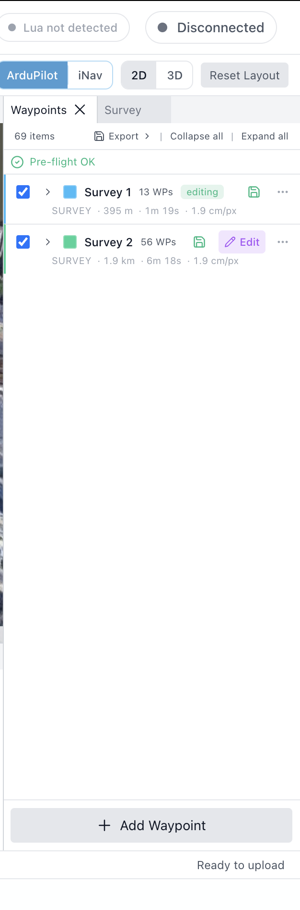
      </a>
      <br/><em>Colored Mission Groups with Per-Block Stats</em>
    </td>
    <td align="center">
      <a href="docs/screenshots/survey_gsd_panel.png?raw=true">
        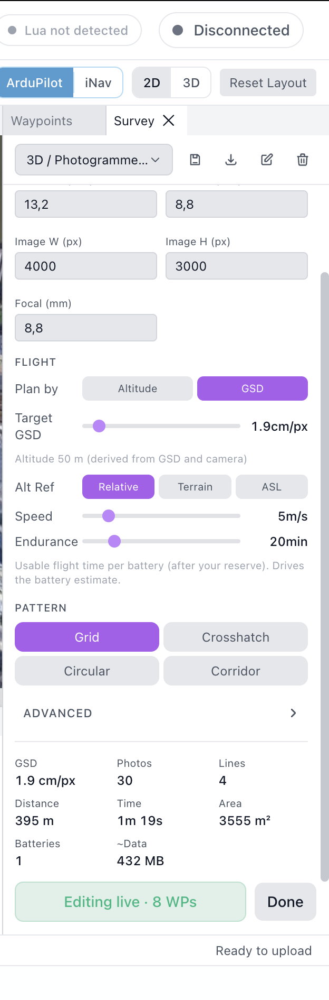
      </a>
      <br/><em>GSD-First Survey Planning</em>
    </td>
  </tr>
  <tr>
    <td align="center">
      <a href="docs/screenshots/mission_panner_3d_view.png?raw=true">
        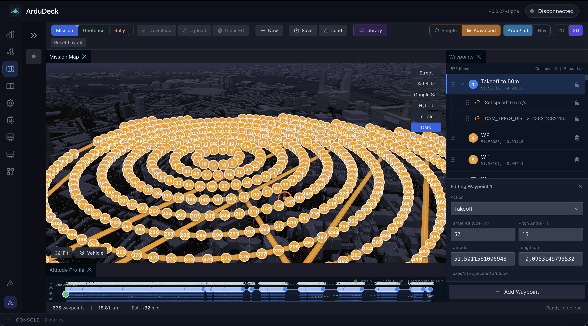
      </a>
      <br/><em>3D Mission Visualization</em>
    </td>
    <td align="center">
      <a href="docs/screenshots/Mission_planning_survey_grid_pattern.png?raw=true">
        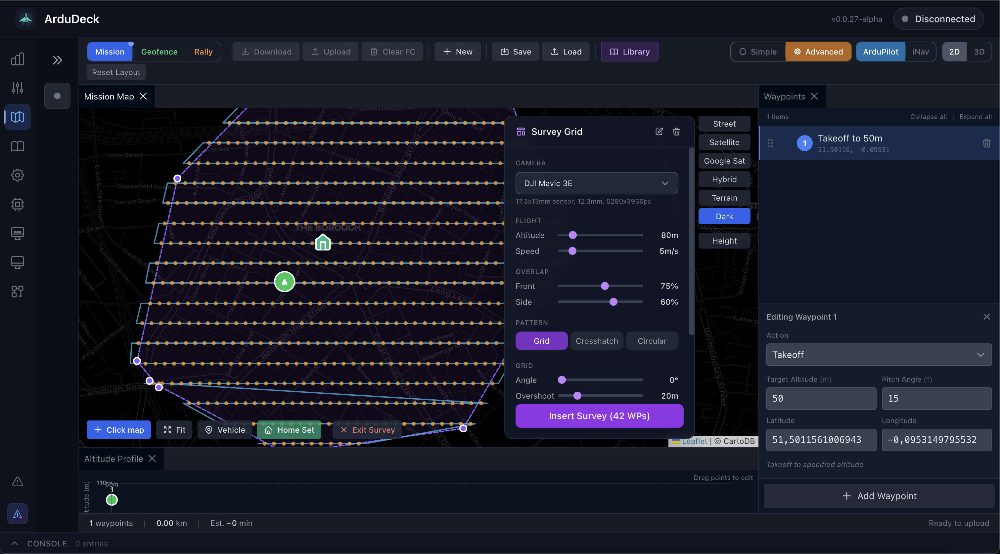
      </a>
      <br/><em>Survey Grid Pattern</em>
    </td>
  </tr>
  <tr>
    <td align="center">
      <a href="docs/screenshots/Mission_planning_survey_grid_crosshatch.png?raw=true">
        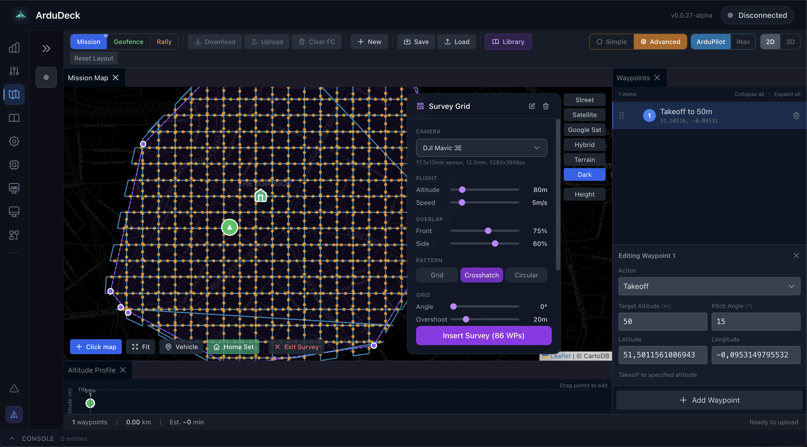
      </a>
      <br/><em>Survey Crosshatch Pattern</em>
    </td>
    <td align="center">
      <a href="docs/screenshots/Mission_planning_survey_circular_pattern.png?raw=true">
        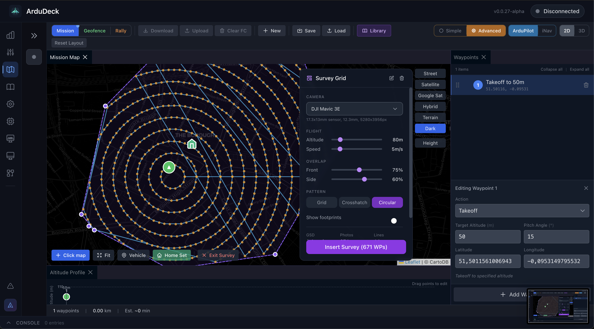
      </a>
      <br/><em>Survey Circular Pattern</em>
    </td>
  </tr>
</table>

### Telemetry & General

<table>
  <tr>
    <td align="center">
      <a href="docs/screenshots/mission_telemetry_layout.png?raw=true">
        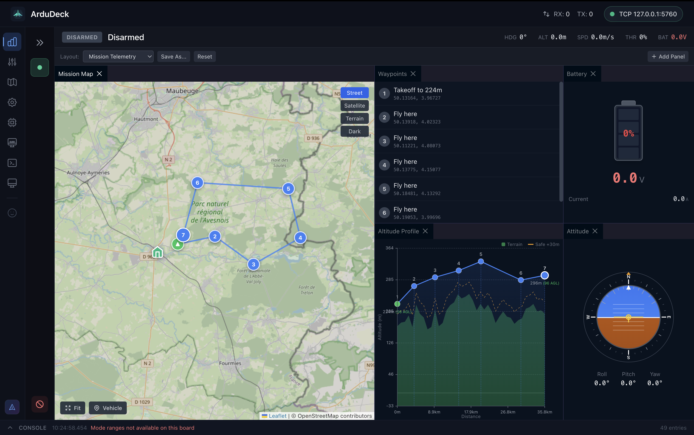
      </a>
      <br/><em>Mission + Telemetry Layout</em>
    </td>
    <td align="center">
      <a href="docs/screenshots/telemetry_dashboard.png?raw=true">
        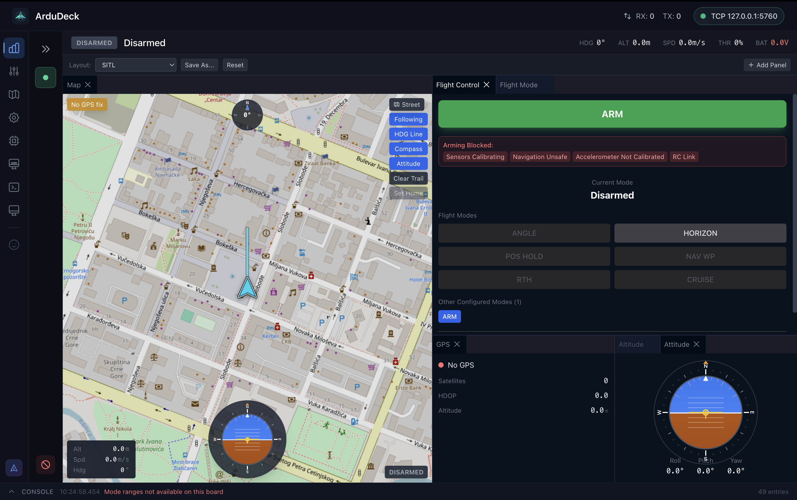
      </a>
      <br/><em>Telemetry Dashboard</em>
    </td>
  </tr>
  <tr>
    <td align="center">
      <a href="docs/screenshots/firmware_flash.png?raw=true">
        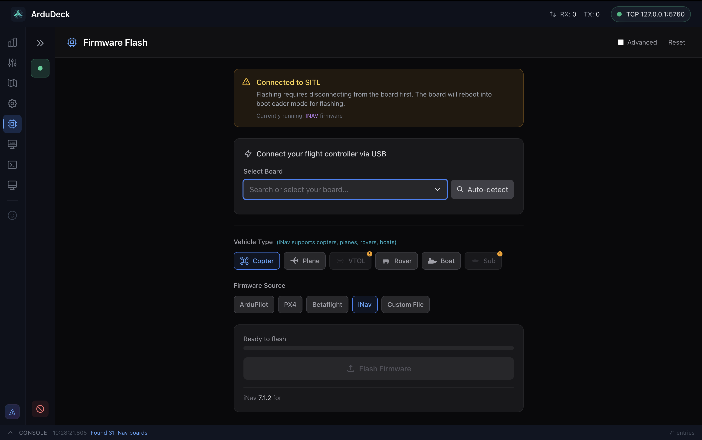
      </a>
      <br/><em>Firmware Flash</em>
    </td>
    <td align="center">
      <a href="docs/screenshots/settings_vehicle_profiles.png?raw=true">
        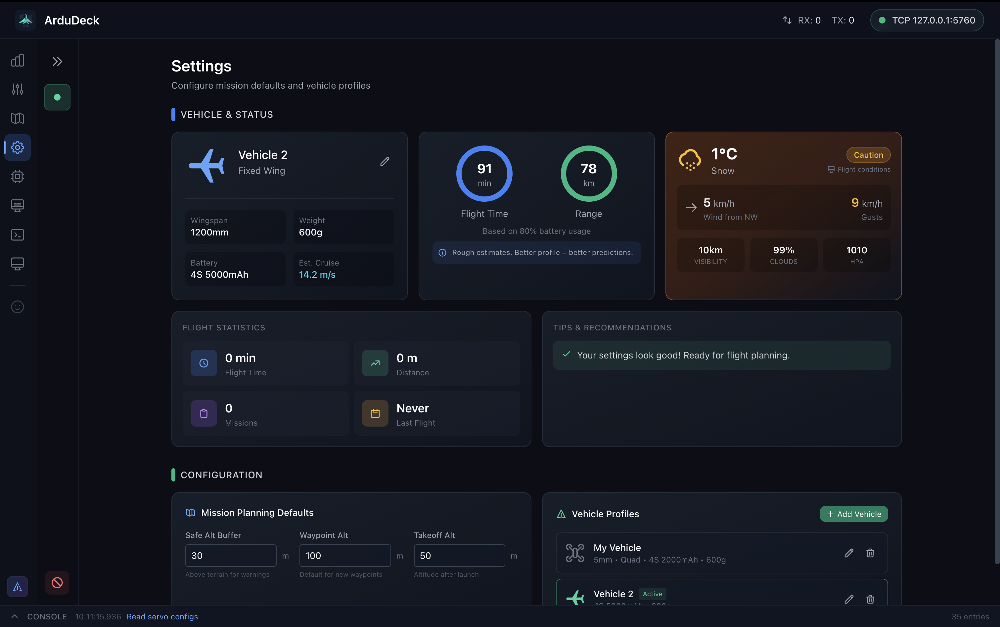
      </a>
      <br/><em>Vehicle Profiles & Weather</em>
    </td>
  </tr>
</table>

### Betaflight/iNav Configuration

<table>
  <tr>
    <td align="center">
      <a href="docs/screenshots/msp_pid_tuning.png?raw=true">
        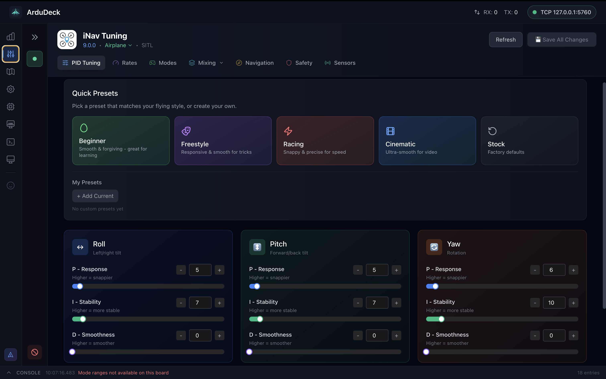
      </a>
      <br/><em>PID Tuning with Quick Presets</em>
    </td>
    <td align="center">
      <a href="docs/screenshots/msp_rates.png?raw=true">
        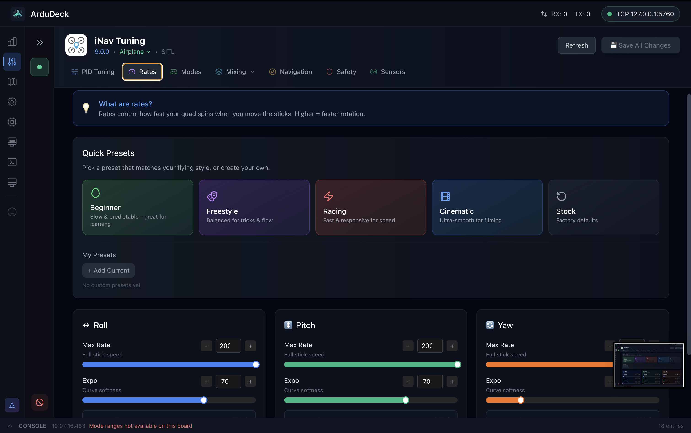
      </a>
      <br/><em>Rates & Expo Configuration</em>
    </td>
  </tr>
  <tr>
    <td align="center">
      <a href="docs/screenshots/msp_modes_simple.png?raw=true">
        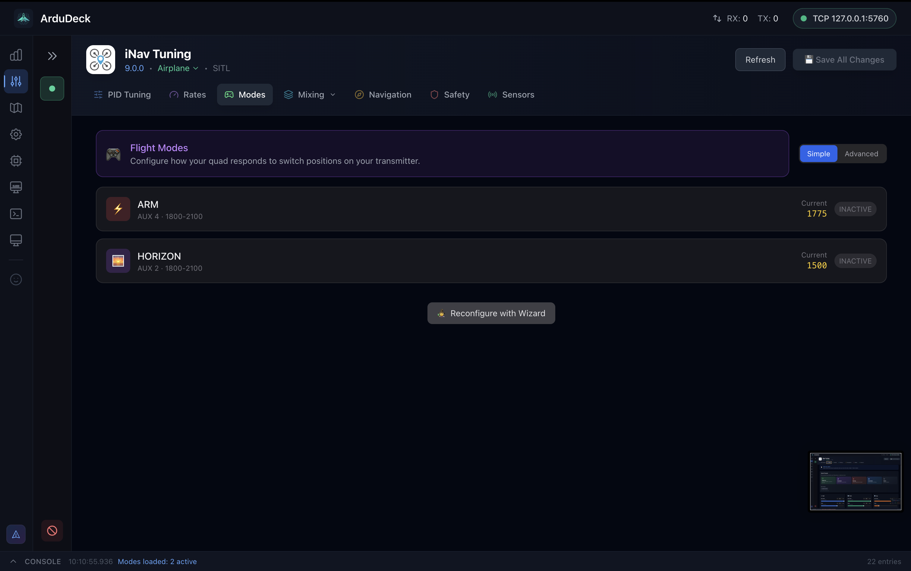
      </a>
      <br/><em>Flight Modes - Simple View</em>
    </td>
    <td align="center">
      <a href="docs/screenshots/msp_modes_wizard.png?raw=true">
        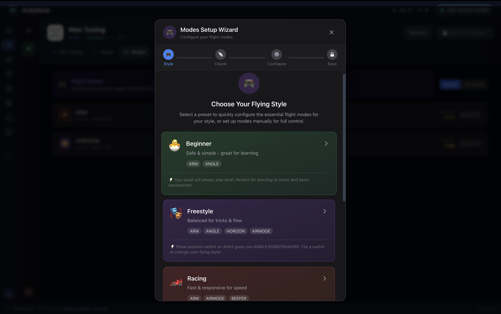
      </a>
      <br/><em>Modes Setup Wizard</em>
    </td>
  </tr>
  <tr>
    <td align="center">
      <a href="docs/screenshots/msp_modes_advanced.png?raw=true">
        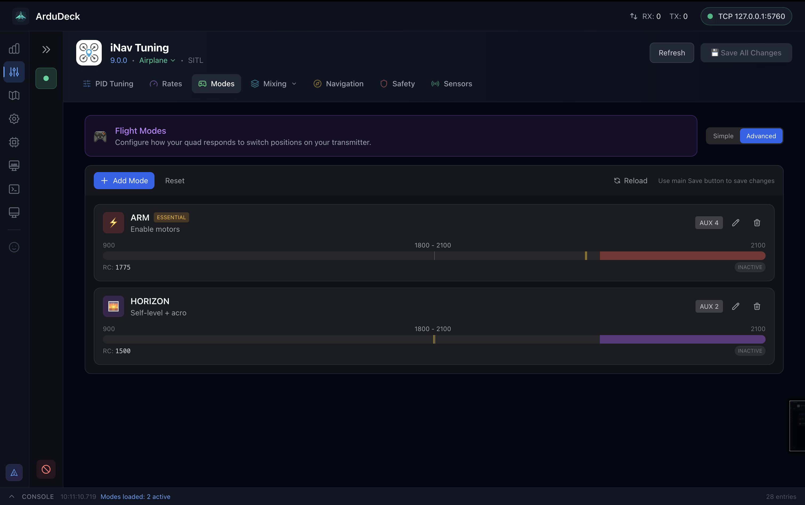
      </a>
      <br/><em>Flight Modes - Advanced View</em>
    </td>
    <td align="center">
      <a href="docs/screenshots/msp_servo_tuning.png?raw=true">
        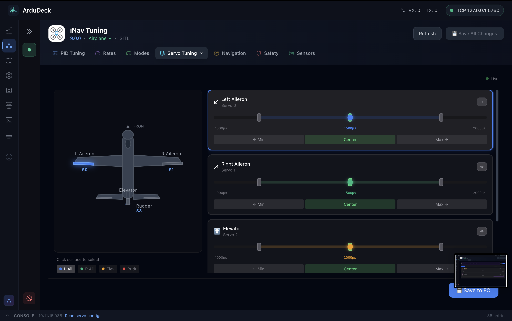
      </a>
      <br/><em>Servo Tuning for Fixed Wing</em>
    </td>
  </tr>
  <tr>
    <td align="center">
      <a href="docs/screenshots/msp_safety_failsafe.png?raw=true">
        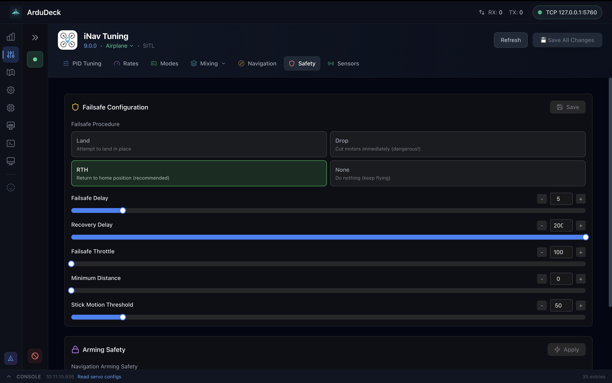
      </a>
      <br/><em>Safety & Failsafe Configuration</em>
    </td>
    <td align="center">
      <a href="docs/screenshots/msp_sensors.png?raw=true">
        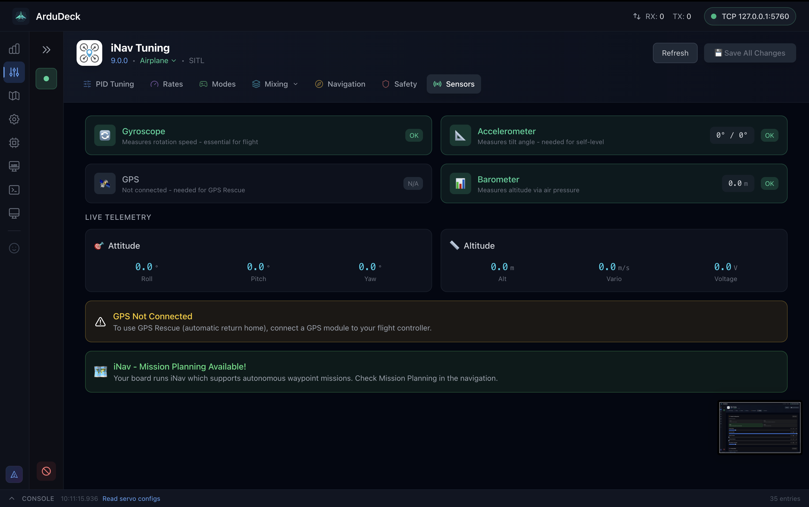
      </a>
      <br/><em>Sensors & Live Telemetry</em>
    </td>
  </tr>
</table>

### ArduPilot Configuration

<table>
  <tr>
    <td align="center">
      <a href="docs/screenshots/Mavlink%20Signing.png?raw=true">
        
      </a>
      <br/><em>MAVLink Signing - Packet Security</em>
    </td>
    <td align="center">
      <a href="docs/screenshots/params_screen.png?raw=true">
        
      </a>
      <br/><em>Parameter Management</em>
    </td>
  </tr>
</table>

### Additional Features

<table>
  <tr>
    <td align="center">
      <a href="docs/screenshots/cli_terminal.png?raw=true">
        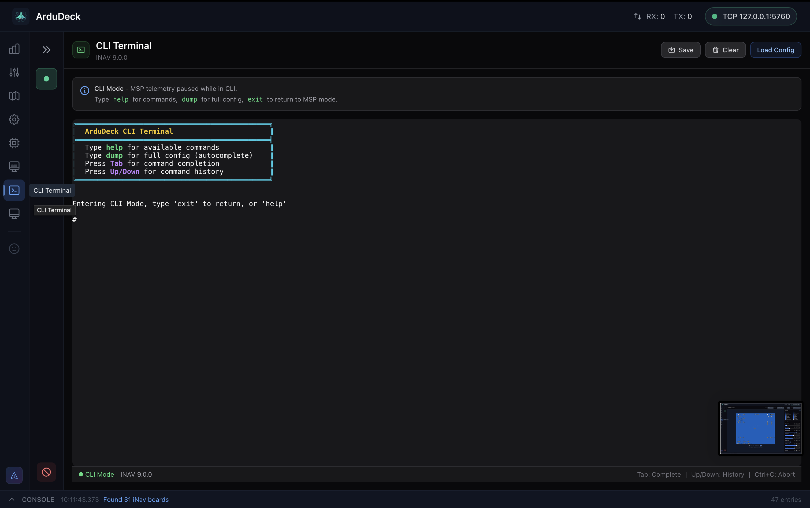
      </a>
      <br/><em>CLI Terminal with Autocomplete</em>
    </td>
    <td align="center">
      <a href="docs/screenshots/sitl_simulator.png?raw=true">
        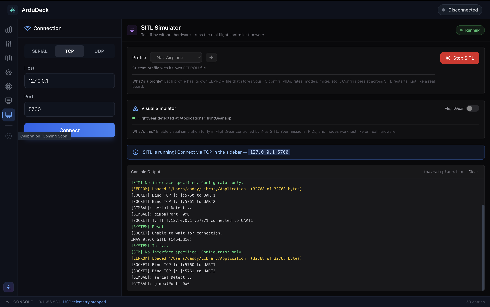
      </a>
      <br/><em>SITL Simulator with FlightGear</em>
    </td>
  </tr>
  <tr>
    <td align="center">
      <a href="docs/screenshots/Mission_planning_survey_grid_generated_circular.png?raw=true">
        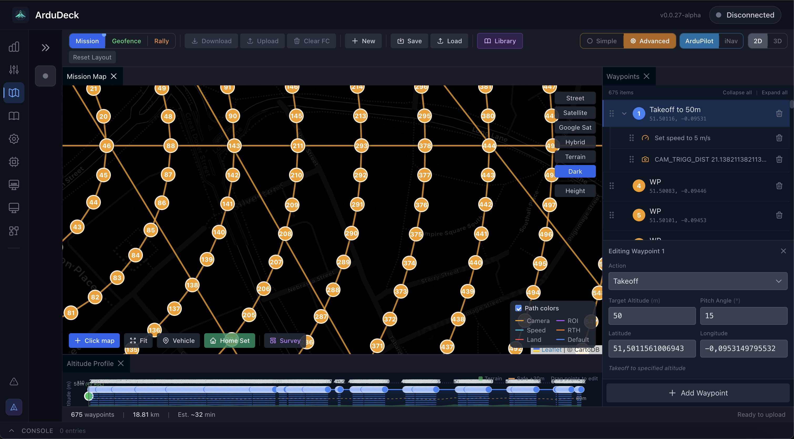
      </a>
      <br/><em>Generated Survey in 3D View</em>
    </td>
    <td></td>
  </tr>
</table>

---

## Download & Install

**Most users should download a pre-built release.** No need to clone or build anything.

> **Windows and Linux.** Jawji ships pre-built releases for Windows and Linux. macOS is coming soon — the source is cross-platform (Electron/React), so contributors can already build and run it from source on macOS in the meantime — see [Development](#development-contributors-only).

| Platform | Format | Link |
|----------|--------|------|
| **Windows** | Installer (.exe) | [Latest Release](https://github.com/utachicodes/jawjideck/releases/latest) |
| **Windows** | Portable (.exe) | [Latest Release](https://github.com/utachicodes/jawjideck/releases/latest) |
| **Linux** | AppImage | [Latest Release](https://github.com/utachicodes/jawjideck/releases/latest) |
| **Linux** | .deb (Debian/Ubuntu) | [Latest Release](https://github.com/utachicodes/jawjideck/releases/latest) |
| **macOS** | Coming soon | — |

**Getting started:** Download the installer, install, plug in your flight controller via USB, and you're ready to go.

> **Note on code signing:** Jawji binaries are currently unsigned. Windows SmartScreen may show a warning — click "More info" then "Run anyway". We plan to obtain a code signing certificate once the project reaches a meaningful user base to justify the cost.
>
> **Auto-updates:** Jawji supports seamless in-app updates on Windows — download and install with a single click. Linux (AppImage/.deb) is new this release; grab new versions from the [releases page](https://github.com/utachicodes/jawjideck/releases) manually for now until in-app updates are verified there too.

---

## Architecture

Jawji is a pnpm monorepo built around an Electron main/renderer split:

| Path | Role |
|------|------|
| [apps/desktop](apps/desktop) | The Electron app. `src/main` talks to flight controllers (serial/TCP/UDP) and the OS; `src/renderer` is the React/TypeScript UI; `src/main/preload.ts` + `src/shared/ipc-channels.ts` define the IPC boundary between them. |
| [packages/mavlink-ts](packages/mavlink-ts) | Generated MAVLink v1/v2 message/enum definitions and codec used to talk to ArduPilot. |
| [packages/msp-ts](packages/msp-ts) | MSP v1/v2 protocol implementation used to talk to Betaflight/iNav. |
| [packages/jawji-controller](packages/jawji-controller) | Companion-board agent (ESP32/RPi/Jetson/Orange Pi) — auto-detects flight controllers, installs mavlink-router/MediaMTX, and runs a TCP/UDP bridge. Express + WebSocket server with bearer-token auth, polled by the desktop app's Controller Dashboard for metrics, logs, and terminal access. |
| [packages/license-verifier](packages/license-verifier) | Shared Ed25519 entitlement-token verification and fail-closed service gating. Zero dependencies. Used by desktop, controller, and orchestrator. |
| [packages/blackbox-parser](packages/blackbox-parser) | Zero-dependency Betaflight/iNav blackbox `.bbl` log parser, rewriting the reference decoders in TypeScript. |
| [packages/module-sdk](packages/module-sdk), [packages/create-jawji-module](packages/create-jawji-module) | SDK and scaffolding for third-party Jawji modules. |

Telemetry flows from the connected flight controller → `src/main` parser → IPC event → renderer Zustand stores (e.g. `telemetry-store`, `flight-control-store`) → dashboard panels. Manual control (arm/disarm, mode switching, takeoff, and a live keyboard/joystick RC override for both MAVLink and MSP vehicles) is sent the same way in reverse: renderer store → IPC → `src/main` → serial/TCP/UDP link to the vehicle.

---

## Development (Contributors Only)

> **Not a developer?** You don't need this section. Just [download the latest release](#download--install) above.

The instructions below are only for contributors who want to modify Jawji's source code and submit pull requests.

### Prerequisites

- **Node.js** 20 or higher
- **pnpm** 9 or higher

### Setup

```bash
# Fork the repo on GitHub first, then clone your fork
git clone https://github.com/<your-username>/Jawji.git
cd Jawji

# Install dependencies
pnpm install

# Build all packages
pnpm build

# Run in development mode
pnpm dev
```

### Build for Production

```bash
pnpm package
```

---

## Supported Vehicles

### ArduPilot (MAVLink)
- **Copter** - Quadcopters, hexacopters, octocopters
- **Plane** - Fixed-wing aircraft, flying wings
- **VTOL** - Tiltrotors, tailsitters, QuadPlanes
- **Rover** - Ground vehicles, boats
- **Submarine** - Underwater ROVs (ArduSub)

### Betaflight & iNav (MSP)
- **Multirotors** - Quads, hexes, octos, tris
- **Fixed Wing** - Traditional, flying wing, V-tail, delta
- **F3/F4/F7/H7** - All STM32 flight controllers

---

## 🎖️ Veteran Board Support

<p align="center">
  <em>"No board left behind"</em>
</p>

Got an old **SPRacing F3**, **Naze32**, or other F3-era board collecting dust? **We've got you covered.**

While other configurators have abandoned these classic boards, Jawji provides a **fully-featured graphical interface** - not just CLI access, but the **same modern UI experience** as newer boards:

| Board Era | Firmware Support | Configuration |
|-----------|------------------|---------------|
| **F3 Boards** | iNav 2.0.0, Betaflight 3.5.7 | **Full GUI** (powered by CLI) |
| **F4/F7/H7** | Latest iNav & Betaflight | Modern MSP Protocol |

### Why We Care

These boards were the **workhorses of the FPV revolution**. They flew millions of packs, survived countless crashes, and taught a generation of pilots how to tune PIDs. They deserve better than a drawer.

### Full GUI for Legacy Boards

No command-line typing required! Jawji automatically detects legacy boards and presents a **complete graphical interface**:

- **PID Tuning Tab** - Sliders and inputs for P/I/D/FF, just like modern boards
- **Rates Tab** - Visual rate configuration with expo curves
- **Mixer Tab** - Graphical motor (`mmix`) and servo (`smix`) mixer editor
- **Servo Tab** - Visual endpoint tuning with range indicators
- **Modes Tab** - Point-and-click flight mode assignment
- **CLI Terminal** - For power users who want raw access with autocomplete

The GUI talks to your board via CLI commands under the hood - you get the **convenience of a modern interface** with the **compatibility of CLI**.

### Supported Legacy Boards

- SPRacing F3 / F3 EVO / F3 Mini / F3 Neo
- Naze32 Rev6
- CC3D (with iNav)
- Flip32 F3
- Seriously Pro Racing F3
- ...and any other F3-era board running iNav < 2.1 or Betaflight < 4.0

**Dust off those veterans and give them one more flight!** 🛩️

---

## Bug Reporting

Found a bug? We want to hear about it! Jawji includes a built-in bug reporting tool that makes it easy to share diagnostic information with the development team.

<p align="center">
  <a href="docs/screenshots/bug-report-screen.png?raw=true">
    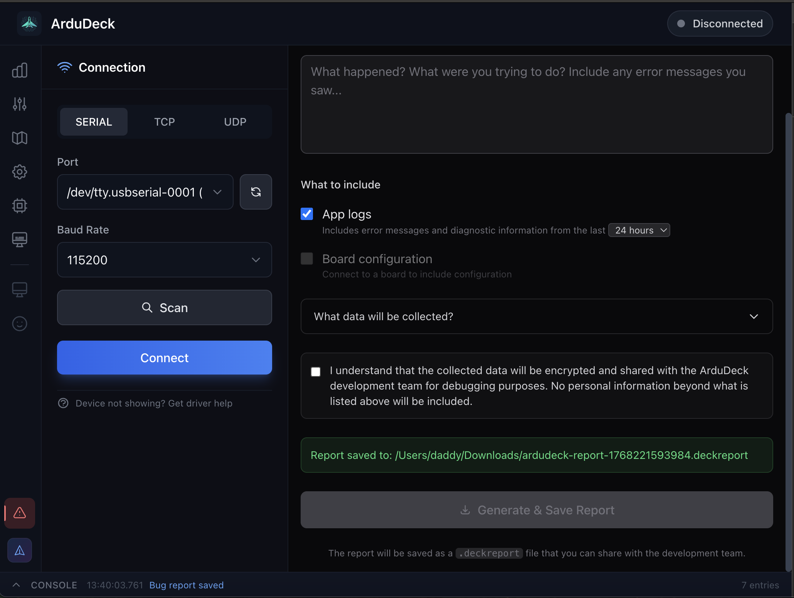
  </a>
  <br/>
  <em>Built-in bug reporting with automatic log collection</em>
</p>

### How to Report a Bug

1. **Open the Bug Report screen** - Click the bug icon in the sidebar or go to **Help > Report Bug**
2. **Describe the issue** - Tell us what happened and what you expected
3. **Choose what to include:**
   - **App logs** - Recent application logs (always recommended)
   - **Board dump** - Flight controller configuration (requires connected board, will trigger reboot)
4. **Review the data** - See exactly what will be collected before sending
5. **Generate report** - Creates an encrypted `.jawjireport` file
6. **Send to developers** - Share the file via GitHub issue or email

### What Gets Collected

| Data | Description | Privacy |
|------|-------------|---------|
| **App logs** | Recent application logs (errors, warnings, debug info) | Paths sanitized, no personal data |
| **System info** | OS, version, architecture | Anonymous |
| **Board dump** | Flight controller settings via CLI `dump` command | Your FC configuration |

### Privacy & Security

- **You control what's shared** - Choose what to include, preview before sending
- **Encrypted reports** - Only the Jawji dev team can decrypt `.jawjireport` files
- **No automatic uploads** - You decide when and how to share the file

---

## Roadmap

### Completed
- Real-time telemetry with dockable dashboard
- Interactive map with vehicle tracking
- Mission planning with terrain-aware altitude profile
- Full parameter management with validation
- Geofence and rally point editing
- Vehicle profiles with weather integration
- Firmware flashing (ArduPilot, Betaflight, iNav)
- Betaflight/iNav PID tuning and configuration
- **CLI Terminal** with autocomplete and command history
- **Legacy F3 board support** via full CLI configuration
- **Calibration wizards** - Accelerometer and compass calibration with step-by-step wizard
- **Quick Setup Wizard** with preset library for common frame types
- **VTX and filter configuration** for Betaflight/iNav
- **ArduPilot configuration UI** - PID tuning, rate profiles, flight modes, safety, battery monitor, sensors
- **Survey Grid Planner** - Automated survey patterns (Grid, Crosshatch, Circular) with camera and flight parameter configuration
- **Mission Groups** - Waypoints organized into colored, per-group survey and manual groups with per-block stats, per-group upload/save, undo, and autosave
- **Corridor Surveys** - Linear surveys along a centerline for roads, rail, and power lines, with plane and copter turn strategies
- **GSD-First Survey Planning** - Plan by ground sample distance, crosshatch at two heights, battery sortie splitting, and KML/KMZ/GeoJSON import
- **3D Mission View** - Three-dimensional visualization of mission waypoints and flight paths
- **MAVLink Signing** - Passphrase-based packet signing for secure vehicle communication
- **Flight Log Analysis** - ArduPilot .bin, PX4 .ulg, and Betaflight .bbl parsers, health checks, log explorer with 3D flight path, and AI-assisted diagnostics
- **SITL Simulator** - ArduPilot, iNav, and Betaflight software-in-the-loop with vehicle/frame selection, virtual RC, custom frame physics, and visual flight simulator integration (FlightGear + X-Plane)
- **Visual Flight Simulator Integration** - FlightGear (free) and X-Plane (commercial) support with one-click launch, automatic detection, and protocol bridge
- **Keyboard & Joystick Flight Control** - Mutually-exclusive GCS stick input (WASD+QE+Arrows or gamepad) for MAVLink and MSP vehicles, with automatic receiver-config detection/fix so control actually reaches the motors
- **Fleet Management** - Multi-vehicle roster with live status monitoring and one-click focus to promote a vehicle to the main connection
- **Camera Feed Panel** - MJPEG and WebRTC video display with manual URL entry and MAVLink stream auto-detection
- **AI Object Detection Module** - YOLOv8-based live object detection overlaid on the Camera panel, running as a local Python process via the module system
- **One-Script Companion Installer** - Single-command setup (`install.sh`) for a Raspberry Pi, Jetson, or generic Linux companion computer, with hardware detection and Basic/Vision/AI profiles
- **Controller Auto-Setup** - Flight controller detection, mavlink-router, MediaMTX video, and TCP/UDP bridge automatically configured on every boot. No manual setup required.
- **MediaMTX Video Relay** - Real multi-protocol media server on the companion side (RTSP/RTMP/HLS/WebRTC), with Jawji Controller exposing live stream status through its API
- **Device Security & Licensing** - Ed25519 entitlement-token enforcement across desktop, controller, and orchestrator. Core GCS stays free under GPL-3.0; paid features require an active subscription.
- **Periodic Auto-Updates** - Re-checks for new releases every 4 hours while the app stays open
- **Focus Mode** - Distraction-free Telemetry dashboard preset showing only Flight Control and Camera panels
- **AI Analysis Improvements** - Alias map for hallucinated type names, improved system prompt warnings
- **Security Hardening** - API keys no longer exposed to renderer, URL validation hardened, SITL EEPROM path traversal fixed, input validation on controller endpoints

### Coming Soon
- macOS release
- Mission-planner map rendering fix (tiles/panel not displaying in some layouts)
- Wiring `jawji-orchestrator`'s status into Jawji's Companion Dashboard so its advisories and confirm/reject actions are visible from the GCS, not just the local API

---

## Contributing

Contributions are welcome! If you'd like to help improve Jawji, see the [Development](#development-contributors-only) section above for build instructions.

1. Fork the repository on GitHub
2. Clone **your fork** (not the main repo)
3. Create a feature branch (`git checkout -b feature/amazing-feature`)
4. Commit your changes (`git commit -m 'Add amazing feature'`)
5. Push to the branch (`git push origin feature/amazing-feature`)
6. Open a Pull Request

> **Just want to use Jawji?** You don't need to fork or clone anything. [Download the latest release](#download--install) instead.

---

## Sponsors

Jawji is supported by companies that contribute hardware, time, or resources to the project.

- [Adlerblix](https://adlerblix.de) - Optical aerial surveying - photogrammetry, RTK precision, large-area mapping. (Germany)

---

## Device Security & Licensing

Jawji uses an open-core model: core offline GCS features (connect, telemetry, mission planning, parameters) are free under GPL-3.0. Paid/cloud features — AI log analysis, cloud sync, Intelligence modules, companion provisioning, and jawji-orchestrator — require an active subscription or license.

### How it works

1. **jawji-gcs** (the server) issues Ed25519-signed entitlement tokens after authentication.
2. Each client binary (desktop, controller, orchestrator) embeds only the **Ed25519 public key** at build time.
3. Tokens are verified **locally offline** — no network call needed during flight.
4. Fail-closed: no public key → paid features denied; expired subscription → paid features denied; tampered token → denied.

### Key generation

```bash
# Generate both keys (run from monorepo root)
node tools/license-keys.mjs

# LICENSE_SIGNING_PRIVATE_KEY  → jawji-gcs server only
# JAWJI_LICENSE_PUBLIC_KEY     → embedded in each client binary
```

### Service enforcement

| Service | Requires |
|---------|----------|
| AI log analysis | Active subscription |
| Cloud sync | Active subscription |
| Intelligence modules | Active subscription OR `intelligence-module` license |
| Companion provisioning | Active subscription |
| Orchestrator | Active `orchestrator` license |

### Architecture

```
jawji-gcs (server)                 jawjideck (desktop)
  signs token with                   verifies token with
  LICENSE_SIGNING_PRIVATE_KEY        embedded JAWJI_LICENSE_PUBLIC_KEY
           |                                    |
           v                                    v
  POST /api/licensing/activate     LicenseGate.requireService('ai-analysis')
  GET  /api/licensing/entitlements         |
           |                               v
           v                     fail-closed if invalid/expired
  { snapshot, token }            encrypted credentials at rest
  (Ed25519 signed)               (safeStorage / AES-256-GCM)
```

### Key files

| File | Role |
|------|------|
| `packages/license-verifier/` | Shared Ed25519 verify + entitlement policy (19 tests) |
| `apps/desktop/src/main/licensing/license-gate.ts` | Main-process fail-closed gate |
| `apps/desktop/src/main/licensing/license-credentials.ts` | Encrypted-at-rest credential store |
| `apps/desktop/src/renderer/lib/license-gate.ts` | Renderer-side entitlement check |
| `packages/jawji-controller/src/licensing/gate.ts` | Controller license gate |
| `tools/license-keys.mjs` | Ed25519 keypair generator |

### Offline grace

All clients cache entitlement tokens locally. A flaky network at boot doesn't gate features that were already entitled. The desktop app uses encrypted safeStorage; the orchestrator caches to `~/.jawji-orchestrator/license-cache.json` with a 7-day grace period.

---

## License

This project is licensed under the **GPL-3.0** - see the [LICENSE](LICENSE) file for details.

---

## Acknowledgments

- [ArduPilot](https://ardupilot.org/) - Open-source autopilot firmware
- [Betaflight](https://betaflight.com/) - Flight controller firmware for multirotors
- [iNav](https://github.com/iNavFlight/inav) - Navigation-focused flight controller firmware
- [Mission Planner](https://github.com/ArduPilot/MissionPlanner) - Original GCS that inspired this project
- [QGroundControl](http://qgroundcontrol.com/) - Cross-platform GCS inspiration
- [MAVLink](https://mavlink.io/) - Micro Air Vehicle communication protocol
- [Leaflet](https://leafletjs.com/) - Interactive maps library

---

<p align="center">
  Made with ❤️ by <a href="https://github.com/utachicodes">Codeforges</a>
</p>
